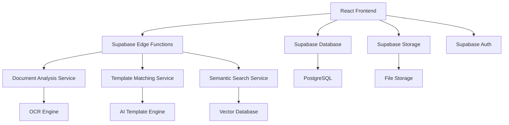
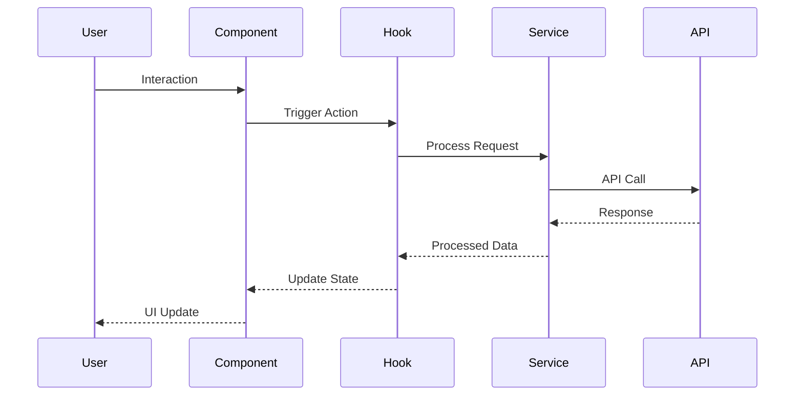
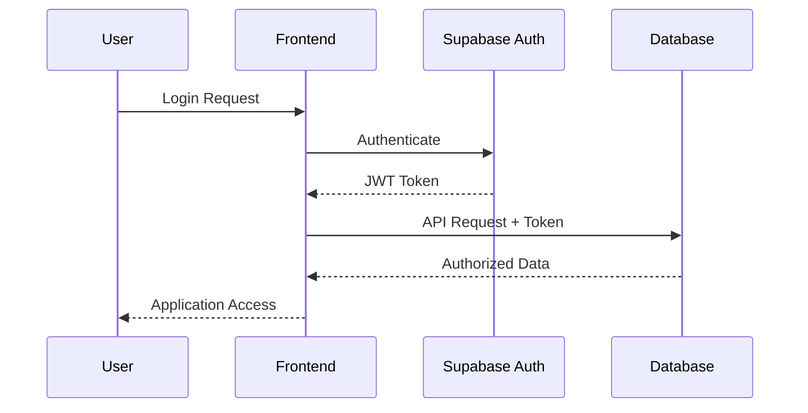
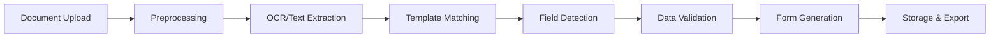
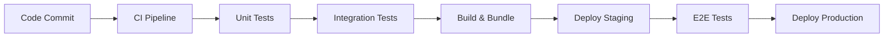

# Architecture Documentation

## Overview

SimplifyAI DocFlow is built as a modern React application with a microservices-oriented backend architecture using Supabase as the primary backend infrastructure.

## System Architecture



## Frontend Architecture

### Component Hierarchy

```
App (AuthProvider, QueryClient)
├── Navigation (Global Navigation)
├── Routes (Protected/Public)
│   ├── Pages (Route Components)
│   │   ├── Index (Dashboard)
│   │   ├── Upload (Document Upload)
│   │   ├── Templates (Template Management)
│   │   ├── Workflows (Workflow Builder)
│   │   └── Forms (Form Management)
│   └── Components (Feature Components)
│       ├── DocumentProcessingWorkflow
│       ├── TemplateEditor
│       ├── FormDesigner
│       └── DocumentManager
└── Providers (Context Providers)
```

### State Management Strategy

#### 1. Component State (useState)
- Local component state
- UI state (modals, forms, toggles)
- Temporary processing state

#### 2. Global State (React Context)
- DocumentProcessingContext - Document workflow state
- AuthContext - User authentication state
- Theme and UI preferences

#### 3. Server State (Tanstack Query)
- API data caching and synchronization
- Background refetching
- Optimistic updates
- Error handling and retry logic

#### 4. Form State (React Hook Form)
- Form validation and submission
- Dynamic form generation
- Field validation and error handling

### Data Flow



## Backend Architecture

### Supabase Infrastructure

#### Database Schema
```sql
-- Core Tables
- users (auth.users) - User management
- profiles - Extended user profiles
- documents - Document metadata
- templates - Document templates
- forms - Dynamic forms
- workflows - Processing workflows
- submissions - Form submissions
- folders - Document organization

-- AI & Processing
- document_embeddings - Vector embeddings
- template_matches - Template matching results
- processing_logs - System audit logs
```

#### Edge Functions
```
/functions/
├── analyze-document/     # Document OCR and analysis
├── generate-embeddings/  # Vector embedding generation
├── semantic-search/      # AI-powered search
├── organize-documents/   # Smart document organization
└── generate-form-app/    # Dynamic form generation
```

#### Storage Buckets
```
Storage/
├── documents/     # Original document files
├── templates/     # Template images and data
├── avatars/       # User profile images
└── exports/       # Generated files and exports
```

### Security Architecture

#### Row Level Security (RLS)
- All tables use RLS policies
- User-scoped data access
- Role-based permissions
- Audit logging for sensitive operations

#### Authentication Flow


## Service Layer Architecture

### Document Analysis Service
```typescript
class DocumentAnalysisService {
  // Singleton pattern for service management
  private static instance: DocumentAnalysisService;
  
  // Core analysis methods
  analyzeDocument(data: string, task: AnalysisTask): Promise<AnalysisResult>
  extractText(data: string): Promise<AnalysisResult>
  detectFields(data: string): Promise<AnalysisResult>
  matchTemplates(data: string): Promise<AnalysisResult>
}
```

### Enhanced Template Management Service
```typescript
class EnhancedTemplateMatchingService {
  // Enhanced template matching with semantic analysis
  findEnhancedMatches(document: string, templates: Template[]): Promise<EnhancedMatch[]>
  calculateSemanticMatches(template: Template, document: Document): number
  applyLearningAdjustments(matches: Match[]): Promise<Match[]>
  updateTemplatePerformance(templateId: string, metrics: Metrics): Promise<void>
}
```

### Enhanced Processing Pipeline


## Performance Optimization

### Frontend Optimizations
- **Code Splitting** - Route-based lazy loading
- **Bundle Optimization** - Tree shaking and minification
- **Image Optimization** - WebP conversion and lazy loading
- **Caching Strategy** - Service worker for offline support
- **State Optimization** - Memo and callback optimization

### Backend Optimizations
- **Database Indexing** - Optimized queries with proper indexes
- **Edge Caching** - CDN and edge function caching
- **Vector Search** - Efficient embedding similarity search
- **File Processing** - Streaming and chunked processing

### Real-time Features
```typescript
// Real-time document processing updates
const subscription = supabase
  .channel('document-processing')
  .on('postgres_changes', {
    event: 'UPDATE',
    schema: 'public',
    table: 'documents',
    filter: `user_id=eq.${userId}`
  }, handleDocumentUpdate)
  .subscribe();
```

## Error Handling Strategy

### Frontend Error Boundaries
```typescript
// Global error boundary for unhandled errors
class ErrorBoundary extends Component {
  // Catch and handle React component errors
  componentDidCatch(error: Error, errorInfo: ErrorInfo) {
    // Log to monitoring service
    // Show user-friendly error message
    // Provide recovery actions
  }
}
```

### API Error Handling
```typescript
// Centralized API error handling
const handleApiError = (error: SupabaseError) => {
  switch (error.code) {
    case 'PGRST116': // Row not found
      return { message: 'Resource not found', action: 'retry' };
    case '23505': // Unique violation
      return { message: 'Duplicate entry', action: 'modify' };
    default:
      return { message: 'An error occurred', action: 'contact_support' };
  }
};
```

## Security Considerations

### Data Protection
- **Encryption at Rest** - All sensitive data encrypted
- **Encryption in Transit** - HTTPS/TLS for all communications
- **API Security** - Rate limiting and request validation
- **File Security** - Virus scanning and content validation

### Privacy Compliance
- **Data Minimization** - Collect only necessary data
- **User Consent** - Clear consent mechanisms
- **Data Retention** - Automated data cleanup policies
- **Export/Delete** - User data portability and deletion

## Monitoring and Observability

### Application Metrics
```typescript
// Performance monitoring
const trackPerformance = (action: string, duration: number) => {
  analytics.track('performance', {
    action,
    duration,
    timestamp: Date.now(),
    userAgent: navigator.userAgent
  });
};

// Error tracking
const trackError = (error: Error, context: string) => {
  analytics.track('error', {
    message: error.message,
    stack: error.stack,
    context,
    userId: user?.id
  });
};
```

### Database Monitoring
- Query performance tracking
- Connection pool monitoring
- Storage usage analytics
- Processing pipeline metrics

## Scalability Considerations

### Horizontal Scaling
- **Stateless Frontend** - Easy deployment scaling
- **Database Scaling** - Read replicas and connection pooling
- **Edge Functions** - Auto-scaling serverless functions
- **CDN Distribution** - Global content delivery

### Vertical Scaling
- **Processing Optimization** - Efficient algorithms and caching
- **Memory Management** - Optimal data structures
- **Database Optimization** - Query optimization and indexing
- **File Processing** - Streaming and chunked processing

## Development Workflow

### Local Development
```bash
# Start all services
npm run dev          # Frontend development server
npm run supabase:start  # Local Supabase instance
npm run functions:serve # Edge functions development
```

### Testing Strategy
```bash
# Testing pyramid
npm run test:unit        # Unit tests (70%)
npm run test:integration # Integration tests (20%)
npm run test:e2e         # End-to-end tests (10%)
```

### Deployment Pipeline
